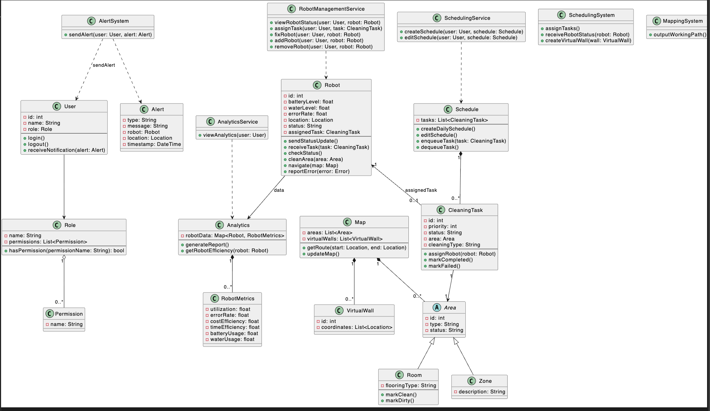

# **Class Diagram Document**

## **Introduction**

This document outlines the class diagram for the Cobotiq robot management system.

---

## **Key Classes and Relationships**

The system is composed of several different classes, each responsible for specific functionalities within the robot management ecosystem. These include:

1. **User, Role, and Permission Classes**
2. **Service Classes for User Actions**
3. **Robot and CleaningTask Classes**
4. **Schedule and Map Classes**
5. **Area, Room, and Zone Classes**
6. **AlertSystem and Alert Classes**
7. **Analytics and RobotMetrics Classes**
8. **System Classes (SchedulingSystem and MappingSystem)**

---

## **1. User, Role, and Permission Classes**

### **User Class**

- **Purpose:** Represents a user of the system.
- **Attributes:**
  - `id`: int
  - `name`: String
  - `role`: Role
- **Methods:**
  - `login()`: Authenticates the user into the system.
  - `logout()`: Logs the user out of the system.
  - `receiveNotification(alert: Alert)`: Receives notifications or alerts.

### **Role Class**

- **Purpose:** Defines the role of a user and associated permissions.
- **Attributes:**
  - `name`: String (e.g., "Senior Manager", "Building Manager")
  - `permissions`: List<Permission>
- **Methods:**
  - `hasPermission(permissionName: String): bool`: Checks if the role includes a specific permission.

### **Permission Class**

- **Purpose:** Represents an individual permission that can be assigned to a role.
- **Attributes:**
  - `name`: String (e.g., "VIEW_ANALYTICS", "CREATE_SCHEDULE")

**Relationships:**

- **User and Role:**
  - Each `User` has one `Role`.
- **Role and Permission:**
  - Each `Role` has multiple `Permission` objects.
- **Usage:**
  - User methods utilize the permissions defined in their associated role to determine access to functionalities.

---

## **2. Service Classes for User Actions**

These classes define the business logic for user actions and enforce permission checks.

### **AnalyticsService Class**

- **Purpose:** Provides analytics functionalities to authorized users.
- **Methods:**
  - `viewAnalytics(user: User)`: Allows a user to view analytics if they have the appropriate permission.

### **SchedulingService Class**

- **Purpose:** Manages scheduling of cleaning tasks.
- **Methods:**
  - `createSchedule(user: User, schedule: Schedule)`: Creates a new schedule.
  - `editSchedule(user: User, schedule: Schedule)`: Edits an existing schedule.

### **RobotManagementService Class**

- **Purpose:** Handles robot-related management tasks.
- **Methods:**
  - `viewRobotStatus(user: User, robot: Robot)`: Views the status of a robot.
  - `assignTask(user: User, task: CleaningTask)`: Assigns a cleaning task to a robot.
  - `fixRobot(user: User, robot: Robot)`: Initiates robot maintenance procedures.
  - `addRobot(user: User, robot: Robot)`: Adds a new robot to the system.
  - `removeRobot(user: User, robot: Robot)`: Removes a robot from the system.

**Note:** Each method in the service classes checks if the user has the necessary permissions before performing the action.

---

## **3. Robot and CleaningTask Classes**

### **Robot Class**

- **Purpose:** Represents a cleaning robot within the system.
- **Attributes:**
  - `id`: int
  - `batteryLevel`: float
  - `waterLevel`: float
  - `errorRate`: float
  - `location`: Location
  - `status`: String (e.g., "Idle", "Cleaning", "Charging")
  - `assignedTask`: CleaningTask
- **Methods:**
  - `sendStatusUpdate()`: Sends the current status to the system.
  - `receiveTask(task: CleaningTask)`: Receives and starts a new cleaning task.
  - `checkStatus()`: Checks the robot's current status.
  - `cleanArea(area: Area)`: Performs cleaning in the specified area.
  - `navigate(map: Map)`: Navigates using the provided map.
  - `reportError(error: Error)`: Reports any errors encountered.

### **CleaningTask Class**

- **Purpose:** Represents a cleaning task assigned to a robot.
- **Attributes:**
  - `id`: int
  - `priority`: int
  - `status`: String (e.g., "Pending", "In Progress", "Completed", "Failed")
  - `area`: Area (Room or Zone)
  - `cleaningType`: String (e.g., "Spot Clean", "Full Clean")
- **Methods:**
  - `assignRobot(robot: Robot)`: Assigns the task to a robot.
  - `markCompleted()`: Marks the task as completed.
  - `markFailed()`: Marks the task as failed.

**Relationships:**

- **Robot and CleaningTask:**
  - A `Robot` can have one assigned `CleaningTask`.
  - A `CleaningTask` can be assigned to a `Robot`.

---

## **4. Schedule and Map Classes**

### **Schedule Class**

- **Purpose:** Manages a collection of cleaning tasks.
- **Attributes:**
  - `tasks`: List<CleaningTask>
- **Methods:**
  - `createDailySchedule()`: Creates a schedule for the day.
  - `editSchedule()`: Edits an existing schedule.
  - `enqueueTask(task: CleaningTask)`: Adds a task to the schedule.
  - `dequeueTask()`: Removes a task from the schedule.

**Relationships:**

- **Schedule and CleaningTask:**
  - A `Schedule` contains multiple `CleaningTask` objects.

### **Map Class**

- **Purpose:** Provides navigation data for robots.
- **Attributes:**
  - `areas`: List<Area>
  - `virtualWalls`: List<VirtualWall>
- **Methods:**
  - `getRoute(start: Location, end: Location)`: Calculates the route between two points.
  - `updateMap()`: Updates the map data.

**Relationships:**

- **Map and Area:**
  - A `Map` composes multiple `Area` objects.
- **Map and VirtualWall:**
  - A `Map` contains multiple `VirtualWall` objects.

---

## **5. Area, Room, and Zone Classes**

### **Area Class (Abstract)**

- **Purpose:** Represents a generic area within the map.
- **Attributes:**
  - `id`: int
  - `type`: String (e.g., "Room", "Zone")
  - `status`: String (e.g., "Clean", "Dirty")

### **Room Class (Extends Area)**

- **Purpose:** Represents a specific room.
- **Attributes:**
  - `flooringType`: String (e.g., "Carpet", "Tile")
- **Methods:**
  - `markClean()`: Marks the room as clean.
  - `markDirty()`: Marks the room as dirty.

### **Zone Class (Extends Area)**

- **Purpose:** Represents a specific zone or area grouping.
- **Attributes:**
  - `description`: String

**Relationships:**

- **Inheritance:**
  - `Room` and `Zone` inherit from `Area`.

---

## **6. VirtualWall Class**

### **VirtualWall Class**

- **Purpose:** Represents virtual barriers within the map.
- **Attributes:**
  - `id`: int
  - `coordinates`: List<Location>

---

## **7. AlertSystem and Alert Classes**

### **AlertSystem Class**

- **Purpose:** Manages the sending of alerts to users.
- **Methods:**
  - `sendAlert(user: User, alert: Alert)`: Sends an alert to a user.

### **Alert Class**

- **Purpose:** Represents an alert or notification.
- **Attributes:**
  - `type`: String (e.g., "Low Battery", "Error")
  - `message`: String
  - `robot`: Robot
  - `location`: Location
  - `timestamp`: DateTime

**Relationships:**

- **AlertSystem and Alert:**
  - `AlertSystem` sends `Alert` objects to `User`.

---

## **8. Analytics and RobotMetrics Classes**

### **Analytics Class**

- **Purpose:** Provides analytics and reporting functionalities.
- **Attributes:**
  - `robotData`: Map<Robot, RobotMetrics>
- **Methods:**
  - `generateReport()`: Generates a comprehensive report.
  - `getRobotEfficiency(robot: Robot)`: Retrieves efficiency metrics for a robot.

### **RobotMetrics Class**

- **Purpose:** Stores performance metrics for a robot.
- **Attributes:**
  - `utilization`: float
  - `errorRate`: float
  - `costEfficiency`: float
  - `timeEfficiency`: float
  - `batteryUsage`: float
  - `waterUsage`: float

**Relationships:**

- **Analytics and RobotMetrics:**
  - `Analytics` aggregates `RobotMetrics` for analysis.

---

## **9. System Classes**

### **SchedulingSystem Class**

- **Purpose:** Coordinates task assignments and robot statuses.
- **Methods:**
  - `assignTasks()`: Assigns tasks to available robots.
  - `receiveRobotStatus(robot: Robot)`: Updates the system with robot status.
  - `createVirtualWall(wall: VirtualWall)`: Adds a virtual wall to the map.

### **MappingSystem Class**

- **Purpose:** Handles navigation and path planning for robots.
- **Methods:**
  - `outputWorkingPath()`: Provides the working path for robots.

---

## **Relationships and Interactions**

- **User Interactions:**
  - Users perform actions through service classes (e.g., `SchedulingService`, `RobotManagementService`).
  - Service classes check the user's permissions via the `Role` and `Permission` classes.

- **Robot Operations:**
  - Robots receive tasks from the `SchedulingSystem`.
  - Robots interact with the `Map` for navigation.
  - Robots report status and errors to the `SchedulingSystem` and `AlertSystem`.

- **Task Management:**
  - `CleaningTask` objects are managed within `Schedule`.
  - Tasks are assigned to robots based on availability and priority.

- **Alert Handling:**
  - The `AlertSystem` sends alerts to users based on events (e.g., low battery).
  - Users receive alerts via the `receiveNotification()` method.

- **Analytics:**
  - The `Analytics` class gathers data from robots to generate reports.
  - `RobotMetrics` provide detailed performance data for analysis.

---

## **Design Principles and Considerations**

- **Flexibility:**
  - The use of `Role` and `Permission` classes allows for easy addition of new roles and permissions without modifying the class hierarchy.

- **Scalability:**
  - The system is designed to accommodate growth in the number of users, robots, and tasks.

- **Maintainability:**
  - Centralized permission management simplifies updates and maintenance.
  - Service classes encapsulate business logic, promoting separation of concerns.

- **Security:**
  - Permission checks ensure that only authorized users can perform specific actions.
  - Roles and permissions can be adjusted as needed for security policies.

- **Reusability:**
  - Abstract classes like `Area` allow for code reuse and extension for different types of areas.

- **User Experience:**
  - The system supports dynamic UI adjustments based on user permissions.
  - Provides informative feedback and alerts to users.

---

## **Example Usage Scenarios**

### **Scenario 1: Senior Manager Viewing Analytics**

- **User Role:** Senior Manager
- **Permissions:** ["VIEW_ANALYTICS", "ACCESS_ALL_REPORTS"]
- **Process:**
  1. Senior Manager logs into the system.
  2. Invokes `AnalyticsService.viewAnalytics(user)`.
  3. The service checks `user.role.hasPermission("VIEW_ANALYTICS")`.
  4. If permission is granted, analytics data is displayed.

### **Scenario 2: Building Manager Creating a Schedule**

- **User Role:** Building Manager
- **Permissions:** ["CREATE_SCHEDULE", "EDIT_SCHEDULE", "VIEW_ROBOT_STATUS"]
- **Process:**
  1. Building Manager logs into the system.
  2. Uses `SchedulingService.createSchedule(user, schedule)`.
  3. The service checks `user.role.hasPermission("CREATE_SCHEDULE")`.
  4. If permission is granted, the schedule is created.

### **Scenario 3: Field Engineer Fixing a Robot**

- **User Role:** Field Engineer
- **Permissions:** ["FIX_ROBOT", "ADD_ROBOT", "REMOVE_ROBOT"]
- **Process:**
  1. Field Engineer logs into the system.
  2. Calls `RobotManagementService.fixRobot(user, robot)`.
  3. The service checks `user.role.hasPermission("FIX_ROBOT")`.
  4. If permission is granted, robot maintenance is initiated.

---

## **Class Diagram Visualized**

